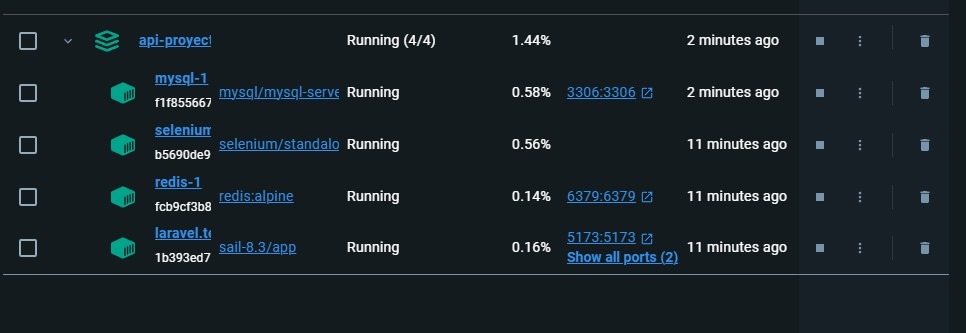

**Ejecución del docker**

docker-compose up -d --build

una vez terminado de montarse revisar si los contenedores estan en funcionamiento, como se ve aqui:

una vez todas las partes del contenedor esten en funcionamiento se ejecuta el comando

docker-compose exec laravel.test php artisan migrate --seed

que lo que hace es crear las tablas de la base de datos para que se pueda llamar a la api sin que diga que no existe el elemento.
